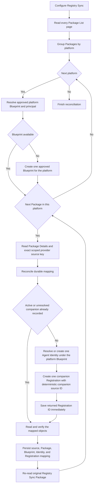
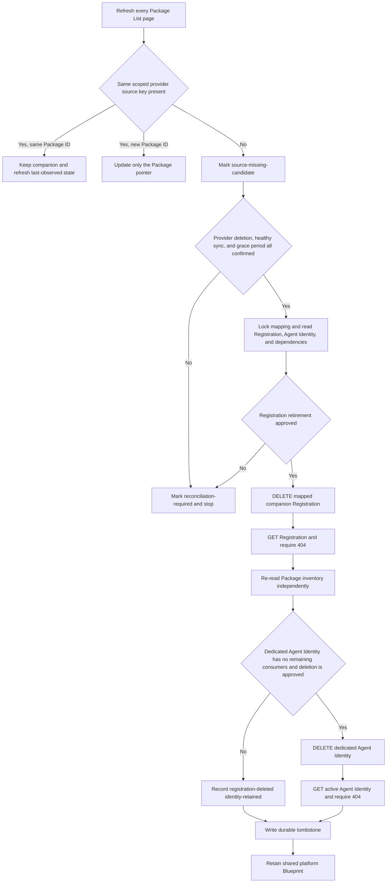
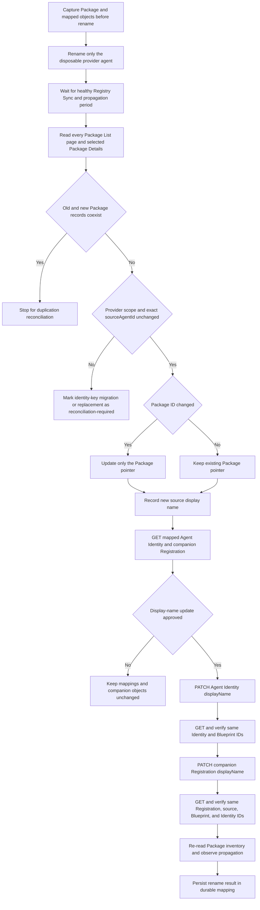

# Lab 20 design decisions

These decisions turn the Lab 20 observations into stable experiment
conventions. They are not Microsoft product contracts and do not establish
that companion registration creation is supported in production.

## Contents

- [DD-001: Registry Sync platform connection names](#dd-001-registry-sync-platform-connection-names)
- [DD-002: Companion source IDs](#dd-002-companion-source-ids)
- [DD-003: Durable relationship mapping](#dd-003-durable-relationship-mapping)
- [DD-004: Add lifecycle](#dd-004-add-lifecycle)
- [DD-005: Delete lifecycle](#dd-005-delete-lifecycle)
- [DD-006: Rename lifecycle](#dd-006-rename-lifecycle)
- [Current boundaries](#current-boundaries)

| ID | Decision | Status |
| --- | --- | --- |
| DD-001 | Use a consistent human-readable name for each Registry Sync platform connection. | Adopted local convention |
| DD-002 | Derive a companion source ID from the exact provider source ID. | Successful in one GCP experiment; production support unresolved |
| DD-003 | Keep a durable source-to-package-to-registration mapping even when the companion source ID is reversible. | Required |
| DD-004 | Add identities through one platform-level Blueprint step followed by a per-Package Agent Identity and companion Registration loop. | Experiment-derived implementation rule; production support unresolved |
| DD-005 | Treat source disappearance as a reconciliation signal and retire the companion Registration before its dedicated Agent Identity. | Experiment-derived implementation rule; production support unresolved |
| DD-006 | Treat a display-name change for the same scoped provider source key as an in-place rename, not delete plus add. | Documented update operations identified; end-to-end rename not yet observed |

## DD-001: Registry Sync platform connection names

Use this display-name format:

```text
<platform>-<env>[-<region>]-<source-scope>
```

The region segment is optional only when region does not apply. An unknown
region must not be treated as not applicable.

| Segment | Rule |
| --- | --- |
| `platform` | Use one controlled lowercase label for the provider, such as `googlevertexai`. Store the canonical Agent 365 platform value separately. |
| `env` | Use a controlled value such as `dev`, `test`, `uat`, or `prod`. Lab 20 remains limited to approved non-production objects. |
| `region` | Use the configured provider region when applicable, such as `us-central1`. |
| `source-scope` | Use a stable project ID, account alias, organization identifier, or workspace identifier. Do not use a mutable display name. |

Synthetic examples:

```text
googlevertexai-dev-us-central1-demo-project
googlevertexai-dev-europe-west1-demo-project
awsbedrock-dev-us-east-1-123456789012
salesforceagentforce-uat-00d000000000000aaa
anthropicclaude-dev-wrk-demo123
```

For Gemini Enterprise Agent Platform, use the project id or a controlled stable
account alias as the source scope.

For AWS Bedrock, use the AWS account ID or a controlled stable account alias
as the source scope.

For Salesforce Agentforce, use the 18-character
organization ID.

For Anthropic Claude Managed Agents, use the dedicated
workspace ID.

AWS and Google connection names include the configured region;
Salesforce and Anthropic connection names omit it because it does not apply
to those connection forms.

Use lowercase letters, digits, and hyphens in the display name. Keep the
actual connection ID, environment, region, and native source-scope identifier
as separate fields. Do not reconstruct authoritative values by splitting the
display name.

The connection name is for operators. It does not prove connection identity,
scope, sync status, Blueprint group membership, or agent ownership. Match an
observed connection by its actual connection ID, scoped by tenant and
platform, when that ID is available.

## DD-002: Companion source IDs

Do not use a random UUID as the complete companion source ID. Derive a stable,
recognizable value from the exact Registry Sync provider source ID:

```text
committed-fleet:companion:v1:<platform-code>:<original-source-agent-id>
```

Use these local platform codes:

| Provider family | Platform code |
| --- | --- |
| Google Vertex AI | `gcp` |
| AWS | `aws` |
| Salesforce | `salesforce` |
| Anthropic Claude | `anthropic` |

Synthetic GCP example:

```text
committed-fleet:companion:v1:gcp:projects%2fdemo-project%2flocations%2fus-central1%2freasoningEngines%2f123456789
```

The fixed prefix identifies a committed-fleet companion, `v1` versions the
format, and the platform code limits cross-provider ambiguity. Everything
after the platform-code separator is the exact provider source ID observed
from Registry Sync.

Preserve that source value byte-for-byte:

- do not URL-decode and re-encode it;
- do not normalize case;
- do not replace slashes, percent escapes, colons, or other provider
  characters;
- let the JSON client serialize it in a request body; and
- apply URL encoding only at an HTTP path or query boundary that requires it.

The same tenant, platform, native scope, and exact source ID must produce the
same companion source ID on every run. If a previously saved value uses
another format, stop for reconciliation rather than silently creating a
second companion.

This format remains part of the experiment. Its acceptance by the Agent
Registration API, including any undocumented character or length limit, must
be observed. Do not automatically retry with a hash after a failure because
that would change more than one experiment variable. If the readable format
is rejected specifically because of length or characters, define a separate
versioned decision such as:

```text
committed-fleet:companion:v2:<platform-code>:sha256:<digest>
```

## DD-003: Durable relationship mapping

A reversible companion source ID reduces operator effort, but it does not
replace the mapping journal. The authoritative source key is scoped, not a
display name:

```text
(tenant, platform, native account/project/workspace scope, exact provider source agent ID)
```

Persist at least:

| Field | Purpose |
| --- | --- |
| `platform` | Canonical Agent 365 platform value. |
| `providerSourceAgentId` | Exact provider-native source value observed through Registry Sync. |
| `connectionId` | Registry Sync provenance when exposed; not the agent identity. |
| `packageId` | Current Registry Sync inventory reference; not a Registration ID. |
| `companionSourceAgentId` | Deterministic DD-002 value. |
| `companionRegistrationId` | Addressable ID returned by a successful registration POST. |
| `blueprintId` | Actual Blueprint application ID used by the companion. |
| `agentIdentityId` | Actual Entra Agent Identity object ID used by the companion. |
| `status` | Planned, pending, created, failed, deleted, or reconciliation-required. |
| `lastObservedAt` | Time at which the relationship was last verified. |
| `sourceDisplayName` | Latest non-authoritative display name observed from Registry Sync. |
| `companionDisplayName` | Last display name successfully applied to the companion objects. |

Enforce one active companion per scoped provider source key and one scoped
provider source key per active companion Registration ID. Treat a POST timeout
or unexpected server response as unresolved until reconciled; deterministic
naming is not permission to resend it.

The Package ID remains an observed inventory pointer because Registry Sync may
change or recreate inventory records. The provider source key anchors the
relationship, while the returned Registration ID anchors supported GET,
PATCH, and DELETE operations on the separately managed companion.

## DD-004: Add lifecycle

The add flow has two different levels. Blueprint preparation is
platform-level work. Agent Identity and companion Registration preparation
are per-agent work performed while iterating through individual Registry Sync
Packages.

### Part 1: Prepare the platform Blueprint once

For each configured platform, first resolve the approved platform Blueprint
and its principal. Create them only when the platform has no approved reusable
objects and creation has been explicitly enabled.

Persist the Blueprint object ID, Blueprint app ID, principal ID, platform, and
capacity state. Do not create a new Blueprint for every Package.

A platform-level Blueprint may still need planned sharding when product limits
or customer isolation requirements prevent every platform agent from sharing
one Blueprint. That is a capacity decision within Part 1; it does not move
Blueprint creation into the per-Package loop.

### Parts 2 and 3: Process one Package at a time

Read every page of Registry Sync Package inventory. For each individual
Package:

1. Read Package Details and extract the exact scoped provider source key:
   `(tenant, platform, native account/project/workspace scope,
   providerSourceAgentId)`.
2. Reconcile that key with the durable mapping. A changed Package ID for the
   same source updates the inventory pointer; it does not create another
   identity or companion.
3. Resolve or create one Agent Identity for that source under the platform
   Blueprint, then save its ID before continuing.
4. Resolve the companion state from the journal. If an active Registration ID
   exists, read and verify it instead of creating another Registration.
5. When an approved source has no existing or unresolved companion, create
   exactly one Registration using the DD-002 companion source ID and the
   source's Agent Identity.
6. Save the returned Registration ID immediately, GET that exact ID, and
   verify its source, Blueprint, Agent Identity, owner, and platform fields.
7. Re-read the original Registry Sync Package and confirm that its independent
   inventory record was not assumed to be enriched or replaced.

Serialize writes for each scoped provider source key. A timeout or unexpected
server response after an Agent Identity or Registration create is an unknown
outcome that requires reconciliation; it must not automatically start another
create.

The intended add states are:

```text
package-observed
-> platform-blueprint-resolved
-> agent-identity-resolved
-> companion-create-pending
-> companion-created
-> companion-association-verified
```

The Blueprint state is shared platform preparation. The remaining states are
tracked independently for each Package/source.

### Add flow

This flow follows the rightmost concept in
[`third_party_agent_registry.svg`](third_party_agent_registry.svg): discover
the platforms first, prepare the shared Blueprint at platform scope, and then
loop through each Package to create or resolve the per-agent objects.



The loop owns one mapping entry, one Agent Identity, and one companion
Registration per scoped provider source. The platform Blueprint is shared
preparation outside that per-Package loop.

## DD-005: Delete lifecycle

Automatic Package disappearance must not automatically delete a companion
Registration or Agent Identity. Registry Sync inventory may be incomplete
because of pagination, propagation delay, connector failure, permissions, or
Package recreation.

Use this reconciliation sequence:

1. Read every page of the latest Package List and match by the DD-003 scoped
   provider source key, not only by the last Package ID or display name.
2. If the previous Package ID is absent but the same provider source key has a
   new Package ID, update the mapping and retain the companion objects.
3. If the source key is absent, mark it `source-missing-candidate`; do not
   delete anything.
4. Confirm that Registry Sync completed successfully and allow the configured
   propagation/grace period. Where available, also confirm through the
   provider that the source agent was deleted. Without adequate confirmation,
   leave the mapping `reconciliation-required`.
5. Lock the source mapping and read the mapped companion Registration, Agent
   Identity, and Blueprint. Verify that they belong to the expected source and
   identify any runtime, authorization, registration, or other mapping
   dependents.
6. After explicit retirement approval, DELETE the known companion Registration
   ID first. GET the same ID and require `404`, then re-read Package inventory
   and the original Package independently. Do not assume Registration deletion
   automatically removes a catalog record.
7. Delete the Agent Identity only under separate approval, and only when it
   was created for this source and no remaining Registration, runtime binding,
   grant, policy, or other consumer depends on it.
8. Retain the platform Blueprint unless its own separately approved retirement
   process proves that it is no longer shared or needed. Blueprint deletion is
   not normal per-agent cleanup.
9. Preserve a tombstone in the durable mapping with the source key, former
   object IDs, deletion reason, timestamps, and final outcomes. The tombstone
   prevents stale inventory from silently creating a replacement companion.

The intended delete states are:

```text
active
-> source-missing-candidate
-> source-deletion-confirmed
-> companion-retirement-approved
-> registration-deleted
-> identity-deleted
-> tombstoned
```

If Registration deletion succeeds but Agent Identity cleanup is blocked or
fails, record that partial state and retry only the identity cleanup according
to its documented semantics. Do not recreate the Registration as recovery.

### Delete flow



The destructive path uses only IDs recovered from the locked mapping.
Registration deletion always precedes Agent Identity deletion. The shared
platform Blueprint is not part of per-agent cleanup.

## DD-006: Rename lifecycle

A provider-side display-name change does not change the agent's identity when
the DD-003 scoped provider source key remains exactly the same. Rename is an
in-place metadata update. It must not create a new Blueprint, Agent Identity,
or companion Registration.

Use this reconciliation sequence:

1. Read every Package List page and the selected Package Details.
2. Match the Package to the existing mapping using the exact scoped provider
   source key. Do not match by display name.
3. If the source key is unchanged and only the Package/provider display name
   changed, record `rename-observed` and update `sourceDisplayName`.
4. Keep the existing platform Blueprint, Agent Identity ID, companion source
   ID, and companion Registration ID.
5. Calculate the intended companion display name from the new source display
   name and the committed-fleet naming convention. Do not reconstruct or
   modify the companion source ID.
6. GET the mapped Agent Identity and companion Registration and verify their
   IDs, Blueprint relationship, source relationship, and ownership before
   changing either object.
7. PATCH the Agent Identity `displayName` through its typed v1.0 endpoint and
   PATCH the known companion Registration `displayName` through its beta
   endpoint. The Registration update can also carry the newly observed
   `sourceLastModifiedDateTime` when that provider value is available and has
   been preserved exactly.
8. GET both objects again and require the intended names. Update
   `companionDisplayName`, rename timestamps, and final status in the mapping.
9. Re-read Package inventory and the original Package independently. Observe
   whether the companion Package representation follows the Registration
   rename; do not assume that propagation is immediate. The original Package's
   display name remains owned by Registry Sync, so do not PATCH it to force
   alignment.

The rename writes are separate operations, not a transaction. Persist the
result after each successful PATCH. If only one update succeeds, record
`rename-partial` and retry only the incomplete PATCH after reading both
objects again. Do not delete and recreate either object as rename recovery.

Do not change `sourceAgentId`, `originatingStore`, Blueprint IDs, Agent
Identity IDs, owners, grants, or runtime configuration as part of a display
name rename.

The intended rename states are:

```text
active
-> rename-observed
-> rename-update-pending
-> rename-partial
-> rename-verified
-> active
```

`rename-partial` is used only when one of the two independently persisted name
updates remains incomplete; a fully successful run can move directly from
`rename-update-pending` to `rename-verified`.

If the provider source ID or native scope changes as well as the display name,
do not classify the event as a rename. Leave both records
`reconciliation-required` until provider-specific evidence proves whether this
is a source migration, a replacement agent, or a delete followed by an add.

The current documented write operations are:

| Object | Operation | Expected success |
| --- | --- | --- |
| Agent Identity | [`PATCH /v1.0/servicePrincipals/{id}/microsoft.graph.agentIdentity`](https://learn.microsoft.com/graph/api/agentidentity-update?view=graph-rest-1.0) with `displayName` | `204 No Content` |
| Companion Registration | [`PATCH /beta/copilot/agentRegistrations/{id}`](https://learn.microsoft.com/microsoft-365/copilot/extensibility/api/admin-settings/agent-registration/agentregistration-update) with `displayName` and, when applicable, `sourceLastModifiedDateTime` | `200 OK` |

The Registration operation remains a beta interface that Microsoft does not
support for production applications. Its rename behavior and Package
propagation must be established in a bounded experiment before automation.

### Rename flow



No PATCH, POST, or DELETE is allowed on the default observation path until
the exact scoped provider source key is proven unchanged. A source-key change
is not treated as a cosmetic rename.

## Current boundaries

- A Registry Sync Package does not expose a documented Registration ID lookup.
- A same-source registration POST currently returns a backend permission
  denial for the sampled GCP records.
- One GCP fresh-companion POST using the DD-002 source ID returned `201`, and
  GET by the returned Registration ID succeeded.
- The original Registry Sync Package remained unchanged after that create.
- A successful companion does not enrich the original Registry Sync Package
  or prove provider-runtime authentication or governance enforcement.
- Registry Sync connection creation and complete connection-detail retrieval
  remain manual or unavailable through the reviewed public interfaces.
- The add and delete flows above are committed-fleet handling decisions derived
  from the experiment. They are not documented Microsoft lifecycle contracts.
- Microsoft documents `displayName` updates for both Agent Identity and Agent
  Registration, but Lab 20 has not yet run an end-to-end provider rename and
  companion-name reconciliation.
