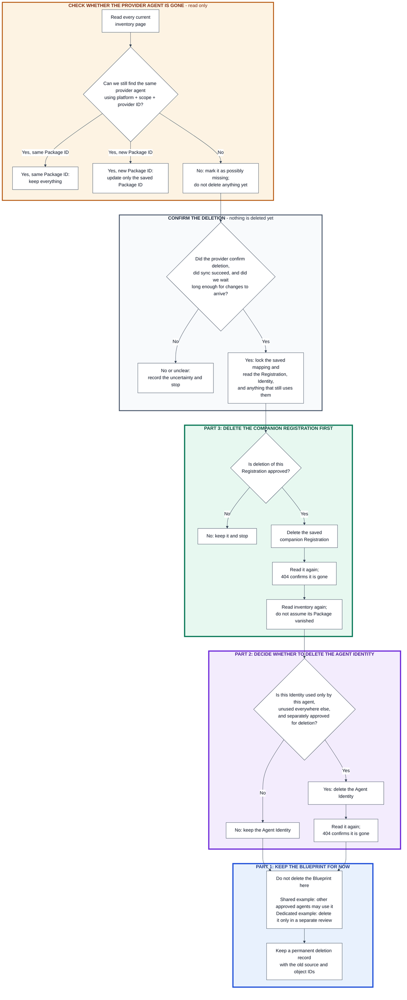

# Lab 20 design decisions

These decisions turn the Lab 20 observations into stable experiment
conventions. They are not Microsoft product contracts and do not establish
that companion registration creation is supported in production.

## Contents

- [DD-001: Registry Sync platform connection names](#dd-001-registry-sync-platform-connection-names)
- [DD-002: Companion source IDs](#dd-002-companion-source-ids)
- [DD-003: Durable relationship mapping](#dd-003-durable-relationship-mapping)
- [DD-004: Blueprint assignment and grouping](#dd-004-blueprint-assignment-and-grouping)
- [DD-005: Add lifecycle](#dd-005-add-lifecycle)
- [DD-006: Delete lifecycle](#dd-006-delete-lifecycle)
- [DD-007: Rename lifecycle](#dd-007-rename-lifecycle)
- [Current boundaries](#current-boundaries)

| ID | Decision | Status |
| --- | --- | --- |
| DD-001 | Use a consistent human-readable name for each Registry Sync platform connection. | Adopted local convention |
| DD-002 | Derive a companion source ID from the exact provider source ID. | Adopted from GCP creation and connection-recreation evidence; production and cross-provider support unresolved |
| DD-003 | Keep a durable source-to-package-to-registration mapping even when the companion source ID is reversible. | Required |
| DD-004 | Default to one dedicated Blueprint per scoped provider source and Agent Identity; retain shared onboarding as an explicit exception. | Adopted local architecture decision; production support unresolved |
| DD-005 | Resolve the DD-004 assignment, prepare one Blueprint per approved group, then create the per-source Agent Identity and companion Registration. | Experiment-derived implementation rule; production support unresolved |
| DD-006 | Treat source disappearance as a reconciliation signal and retire the companion Registration before its dedicated Agent Identity. | Experiment-derived implementation rule; production support unresolved |
| DD-007 | Treat a display-name change for the same scoped provider source key as an in-place rename, not delete plus add. | Documented update operations identified; end-to-end rename not yet observed |

## DD-001: Registry Sync platform connection names

Use this display-name format:

```text
<platform>-<env>[-<region>]-<source-scope>
```

The region segment is optional only when region does not apply. An unknown
region must not be treated as not applicable.

| Segment | Rule |
| --- | --- |
| `platform` | Use one controlled lowercase label for the provider, such as `googlevertexai`. Store the canonical Agent 365 platform value separately. |
| `env` | Use a controlled value such as `dev`, `test`, `uat`, or `prod`. Lab 20 remains limited to approved non-production objects. |
| `region` | Use the configured provider region when applicable, such as `us-central1`. |
| `source-scope` | Use a stable project ID, account alias, organization identifier, or workspace identifier. Do not use a mutable display name. |

Synthetic examples:

```text
googlevertexai-dev-us-central1-demo-project
googlevertexai-dev-europe-west1-demo-project
awsbedrock-dev-us-east-1-123456789012
salesforceagentforce-uat-00d000000000000aaa
anthropicclaude-dev-wrk-demo123
```

For Gemini Enterprise Agent Platform, use the project id or a controlled stable
account alias as the source scope.

For AWS Bedrock, use the AWS account ID or a controlled stable account alias
as the source scope.

For Salesforce Agentforce, use the 18-character
organization ID.

For Anthropic Claude Managed Agents, use the dedicated
workspace ID.

AWS and Google connection names include the configured region;
Salesforce and Anthropic connection names omit it because it does not apply
to those connection forms.

Use lowercase letters, digits, and hyphens in the display name. Keep the
actual connection ID, environment, region, and native source-scope identifier
as separate fields. Do not reconstruct authoritative values by splitting the
display name.

The connection name is for operators. It does not prove connection identity,
scope, sync status, Blueprint group membership, or agent ownership. Match an
observed connection by its actual connection ID, scoped by tenant and
platform, when that ID is available.

## DD-002: Companion source IDs

Do not use a random UUID as the complete companion source ID. Derive a stable,
recognizable value from the exact Registry Sync provider source ID:

```text
agent-governance:companion:v1:<platform-code>:<original-source-agent-id>
```

Use these local platform codes:

| Provider family | Platform code |
| --- | --- |
| Google Vertex AI | `gcp` |
| AWS | `aws` |
| Salesforce | `salesforce` |
| Anthropic Claude | `anthropic` |

Synthetic GCP example:

```text
agent-governance:companion:v1:gcp:projects%2fdemo-project%2flocations%2fus-central1%2freasoningEngines%2f123456789
```

The fixed prefix identifies a companion owned by the customer-wide agent
governance capability, `v1` versions the format, and the platform code limits
cross-provider ambiguity. The namespace deliberately does not encode a
committed fleet, rollout wave, or demonstration cohort because those are
selection and delivery concepts rather than the solution's applicability
boundary. Everything after the platform-code separator is the exact provider
source ID observed from Registry Sync.

Preserve that source value byte-for-byte:

- do not URL-decode and re-encode it;
- do not normalize case;
- do not replace slashes, percent escapes, colons, or other provider
  characters;
- let the JSON client serialize it in a request body; and
- apply URL encoding only at an HTTP path or query boundary that requires it.

The same tenant, platform, native scope, and exact source ID must produce the
same companion source ID on every run. If a previously saved value uses
another format, stop for reconciliation rather than silently creating a
second companion.

This format remains part of the experiment. Its acceptance by the Agent
Registration API, including any undocumented character or length limit, must
be observed. Do not automatically retry with a hash after a failure because
that would change more than one experiment variable. If the readable format
is rejected specifically because of length or characters, define a separate
versioned decision such as:

```text
agent-governance:companion:v2:<platform-code>:sha256:<digest>
```

The earlier GCP experiment created one Registration with the legacy
`committed-fleet:companion:v1` prefix. Preserve that exact observed value in
its durable mapping. Do not delete or recreate the Registration solely to
rename the namespace. New companion Registrations use
`agent-governance:companion:v1`.

### Evidence confirming the identity anchor

The GCP stability experiment compared the exact provider source ID, Registry
Sync connection ID, and Package ID across three controlled events:

| Event | Provider source ID | Connection ID | Package ID | Interpretation |
| --- | --- | --- | --- | --- |
| No-change sync | Unchanged | Unchanged | Unchanged | Control only; both identity candidates survived. |
| Provider display-name rename | Unchanged | Unchanged | Unchanged | Rename is metadata-only but does not distinguish the candidates. |
| Delete and recreate the Registry Sync connection while retaining the provider agent | Unchanged | Changed | Changed | The provider source survived rematerialization while the connection and inventory representations did not. |

After connection deletion, the target Package count changed from one to zero.
After connection recreation and a successful sync, exactly one matching target
returned under a new Package ID; the old Package did not remain as a duplicate.

Continue using the DD-002 companion source ID derived from the exact scoped
provider source ID. Do not derive it from either the current Package ID or the
Registry Sync connection ID. Those values remain useful mapping and provenance
fields, but the experiment demonstrated that they can change while the
provider agent remains the same.

This conclusion is evidence-backed only for the tested Google Vertex AI
connection lifecycle. AWS, Salesforce, and Anthropic must each be observed
independently before treating the same stability behavior as cross-provider
fact.

## DD-003: Durable relationship mapping

A reversible companion source ID reduces operator effort, but it does not
replace the mapping journal. The authoritative source key is scoped, not a
display name:

```text
(tenant, platform, native account/project/workspace scope, exact provider source agent ID)
```

Persist at least:

| Field | Purpose |
| --- | --- |
| `platform` | Canonical Agent 365 platform value. |
| `providerSourceAgentId` | Exact provider-native source value observed through Registry Sync. |
| `connectionId` | Registry Sync provenance when exposed; not the agent identity. |
| `packageId` | Current Registry Sync inventory reference; not a Registration ID. |
| `companionSourceAgentId` | Deterministic DD-002 value. |
| `companionRegistrationId` | Addressable ID returned by a successful registration POST. |
| `assignmentMode` | `unassigned`, `shared`, or `dedicated`; store it separately from the group label. |
| `blueprintGroup` | Stable customer-defined policy label; null while unassigned. |
| `groupingPolicyVersion` | Approved policy version that assigned the source to the group. |
| `blueprintObjectId` | Blueprint application object ID used by the group. |
| `blueprintId` | Blueprint application `appId` used by the companion. |
| `blueprintPrincipalId` | Tenant-local Blueprint principal object ID. |
| `agentIdentityId` | Actual Entra Agent Identity object ID used by the companion. |
| `status` | Planned, pending, created, failed, deleted, or reconciliation-required. |
| `lastObservedAt` | Time at which the relationship was last verified. |
| `packageDisplayName` | Latest non-authoritative display name observed on the provider-owned Registry Sync Package. |
| `blueprintDisplayName` | Last display name observed on the mapped Blueprint. |
| `blueprintPrincipalDisplayName` | Last display name observed on the mapped Blueprint principal. |
| `agentIdentityDisplayName` | Last display name observed on the mapped Agent Identity. |
| `companionRegistrationDisplayName` | Last display name observed on the companion Registration. |
| `companionPackageDisplayName` | Last display name observed on the materialized companion Package. |
| `nameSyncStatus` | `in-sync` when every in-scope name follows policy, `pending` before any target name is applied, `partial` when only some names match, or `blocked` when a required update cannot safely run. |
| `sourceLastModifiedDateTime` | Exact provider source modification time observed in Package Details. |

Enforce one active companion per scoped provider source key and one scoped
provider source key per active companion Registration ID. Treat a POST timeout
or unexpected server response as unresolved until reconciled; deterministic
naming is not permission to resend it.

The Package ID remains an observed inventory pointer because Registry Sync may
change or recreate inventory records. The provider source key anchors the
relationship, while the returned Registration ID anchors supported GET,
PATCH, and DELETE operations on the separately managed companion.

## DD-004: Blueprint assignment and grouping

Default each new eligible scoped provider source selected for onboarding to
one dedicated Blueprint and one Agent Identity:

```text
one scoped provider source
-> one dedicated Blueprint
-> one Agent Identity
```

This is a one-to-one Blueprint-to-Agent-Identity relationship for the default
path, not one Blueprint per platform, Registry Sync connection, or Package.
Use the DD-003 source key to reconcile an existing assignment when a Package
or connection changes.

This is a local architecture decision, not a Microsoft requirement that every
Blueprint have only one Agent Identity. Keep `shared` as a separate, explicitly
approved onboarding path. Do not delay normal onboarding while someone
searches for a possible shared group.

### Why dedicated is the default

1. **A Blueprint is more than a template.** It holds authentication
   credentials and protocol settings and can acquire tokens for its child
   Agent Identities. It also defines inheritable baseline permissions.
   Compromise of that authentication authority can expose access granted to
   multiple children, even when their individual permissions differ.
2. **Registry Sync does not establish safe sharing.** A common platform,
   offering, project, account, team, or deployment method does not prove that
   agents should share Entra authentication authority. The onboarding service
   must not require its operator to understand every provider's runtime
   internals or have a complete view of all organizational Blueprint groups.
3. **Onboarding must not wait for a sharing decision.** A provider team might
   create an agent before any sharing policy is updated. An approved
   dedicated-default policy lets the service assign that source immediately,
   without a per-agent human gate merely to decide whether it could share.
4. **Unnecessary separation has a more manageable cost than unsafe sharing.**
   Dedicated Blueprints add objects, credential configuration, permission
   maintenance, quota pressure, and drift risk. Reusable desired-state
   templates and batch reconciliation can reduce that work without sharing
   authentication credentials. They do not remove quotas or the need for
   authorization, but administrative convenience alone does not justify
   expanding the credential compromise impact.

Separate Blueprint IDs are not sufficient isolation if the same secret,
external workload identity, or unrestricted credential broker can authenticate
as all of them. When credentials or federation are configured, preserve the
intended separation of authentication authority. A prompt-level compromise
does not by itself prove that this authority has been compromised.

Microsoft documents the credential model and trust-boundary considerations
in [Agent identity blueprints](https://learn.microsoft.com/en-us/entra/agent-id/agent-blueprint)
and [Plan an agent identity architecture](https://learn.microsoft.com/en-us/entra/agent-id/how-to-plan-agent-identity-architecture#step-3-decide-how-many-agent-identity-blueprints).
The dedicated default is this solution's response to those considerations
and the limits of Registry Sync evidence.

### Assignment modes

Store `assignmentMode` separately from `blueprintGroup`, the stable key for a
Blueprint binding. A dedicated assignment is a single-member group, so both
paths use DD-005's same lifecycle code; it does not require discovering an
organizational group first.

| Mode | Meaning | Creation behavior |
| --- | --- | --- |
| `dedicated` | Default; the Blueprint is reserved for one source's Agent Identity. | Generate a single-member assignment under the standing policy, without a separate sharing review. |
| `shared` | Explicitly approved exception for exact members that may safely share authentication authority and inherited baseline permissions. | Approve membership and the intended Blueprint binding before creating member identities. |
| `unassigned` | No established assignment because prerequisites are missing, a decision is pending, or a safety hold applies. | Create no Blueprint, Agent Identity, or companion Registration. |

An `unassigned` source has `blueprintGroup: null`; never create an "unassigned
Blueprint". Existing bindings are retained when processing is blocked, not
reset to `unassigned`. Missing a source-specific sharing policy is not a
reason to hold an otherwise eligible source.

### Resolve assignments without a sharing gate

The standing onboarding policy supplies `responsibleTeam`,
`credentialController`, `maintainer`, and `baselineAccessDecision`, either
directly or through pre-approved source-to-policy lookup rules. Baseline
access may explicitly be provisioning-only; assigning a Blueprint does not
grant runtime permissions. The policy also supplies its `policyVersion` and
`approvalReference`. Record the resolved values with the generated assignment,
without requesting fresh approval merely because a new source was discovered.

Source-specific prerequisites remain the complete DD-003 source key and
eligibility under that policy, including authorization to create the required
objects. If the policy cannot resolve required ownership, credential
responsibility, or baseline access, stop that source rather than inventing
values or permissions.

1. Confirm the source is selected for onboarding under an approved policy and
   has the complete DD-003 source key. Missing required authorization,
   explicit holds, conflicting mappings, or unresolved writes stop that
   source. Keep a source without an established assignment `unassigned`;
   retain an existing assignment and its known IDs, recording the stop reason
   and `reconciliation-required` for conflicting or unresolved state.
2. Reconcile an existing assignment and Blueprint binding before creating
   anything. Preserve valid existing dedicated or shared bindings. A parent
   mismatch requires reconciliation, not a new dedicated Blueprint as a
   fallback.
3. Process a new source explicitly selected for shared onboarding through
   that separate approval path. Approve its exact membership, credential
   authority, baseline access, ownership, lifecycle and disablement impact,
   capacity, and intended Blueprint binding before creating member identities.
   A pending decision holds only the selected sources.
4. For every other new eligible source, generate a deterministic
   single-member `dedicated` assignment under the approved default policy.
   Record the group, exact member, policy version, and approval reference
   before DD-005 prepares its Blueprint.

An "approved assignment" in DD-005 includes this generated dedicated
assignment. Its approval reference points to the standing policy, not a new
per-source sharing decision.

### Minimum binding invariants

1. Every selected scoped source has one assignment state and, when assigned,
   exactly one approved group. Each `(tenant, blueprintGroup)` has at most one
   active Blueprint binding.
2. A dedicated group has exactly one scoped source and at most one active
   Agent Identity. Completed provisioning gives that source one Blueprint
   and one Agent Identity; never reuse its Blueprint for another source or
   group.
3. Keep `blueprintGroup` stable and unique within the tenant. Generate default
   keys from the complete DD-003 source key, not a display name. Store mode,
   exact `members`, and policy metadata explicitly; do not infer them by
   parsing the key. Stored object IDs, not display names, identify the bound
   Entra objects.
4. Persist and reuse the DD-003 mapping, including the assignment's
   `policyVersion` as `groupingPolicyVersion`. Changing a group key or binding
   requires a separately approved migration that accounts for credentials,
   permissions, and consumers and retains historical mappings. A later
   sharing proposal must not automatically consolidate Blueprints, reparent
   or replace Agent Identities, or delete old objects.
5. The companion source ID remains derived from the provider source under
   DD-002; assignment mode, group changes, and display-name changes do not
   change it.

## DD-005: Add lifecycle

The add flow is source-first. Discover the complete inventory, then process
each selected Registry Sync Package end to end: resolve its assignment,
prepare or reuse the assignment's Blueprint and principal, resolve its Agent
Identity, and resolve its companion Registration.

Assignments and Blueprint bindings remain group-level state even though the
workflow reaches them while processing one source. Lock and reconcile the
`(tenant, blueprintGroup)` binding before creating anything so a later member
of an approved shared group reuses the same Blueprint. The default dedicated
path has one source in the group, so its executable sequence is the same as
the successful Experiment 03 sequence.

DD-004 defines the assignment modes, group invariants, and policy data used by
this lifecycle. DD-005 consumes that decision; it does not redefine grouping.

The implementation must not require a separate tenant-wide grouping pass
before onboarding can begin. It may batch assignment planning and Blueprint
preparation for efficiency, but that optimization must preserve the same
source-level decisions, locks, write gates, and persisted outcomes described
below.

### Part 1: Resolve the source assignment and prepare its group Blueprint

After discovering the complete Package inventory, select one Package, read
its details, and resolve one approved DD-004 assignment for its scoped provider
source. Reconcile existing bindings first; for a new eligible source, generate
the dedicated assignment under the standing policy unless the source is
explicitly selected for shared onboarding. An assignment need not exist before
discovery.

An `unassigned` source stops at `blueprint-assignment-required`. It remains in
the observed inventory and journal, but no Entra or companion object is
created for it. Never create an "unassigned Blueprint" because that would
silently place unrelated, unreviewed sources into one shared credential
boundary.

For the source's approved `(tenant, blueprintGroup)`:

1. Validate the policy version and member allowlist.
2. Enforce that `dedicated` groups contain exactly one active scoped source.
3. Resolve the group's existing Blueprint application and tenant-local
   principal from the durable binding.
4. Create them only when no approved reusable binding exists and creation has
   been explicitly enabled.
5. Read or create the tenant-local Blueprint principal and verify that it is
   enabled.
6. Persist the Blueprint object ID, Blueprint app ID, principal ID, platform
   and offering classifications, assignment mode, policy version, and
   capacity state before creating the source's Agent Identity.

Prepare one Blueprint per approved group, not one Blueprint per platform and
not automatically one Blueprint per Package. Multiple groups can exist within
one platform or connection. Multiple platforms or connections may share a
group only when an explicit review approves the same credential and
governance boundary.

Capacity sharding creates another explicitly approved group; it must not
silently bind one existing group label to multiple active Blueprints.

### Parts 2 and 3: Complete the selected source

For each selected Package:

1. Read Package Details and extract the exact scoped provider source key:
   `(tenant, platform, native account/project/workspace scope,
   providerSourceAgentId)`.
2. Reconcile that key with the durable mapping. A changed Package ID for the
   same source updates the inventory pointer; it does not create another
   identity or companion.
3. Resolve the approved assignment. If it is `unassigned`, record
   `blueprint-assignment-required` and stop processing that source.
4. Complete Part 1 by reading and verifying the active Blueprint and principal
   binding for the source's approved `(tenant, blueprintGroup)`.
5. In Part 2, resolve or create one Agent Identity for that source under the group
   Blueprint, then save its ID before continuing.
6. In Part 3, resolve the companion state from the journal. If an active Registration ID
   exists, read and verify it instead of creating another Registration.
7. When an approved source has no existing or unresolved companion, create
   exactly one Registration using the DD-002 companion source ID and the
   source's Agent Identity.
8. Save the returned Registration ID immediately, GET that exact ID, and
   verify its source, Blueprint, Agent Identity, owner, and platform fields.
9. Re-read the original Registry Sync Package and confirm that its independent
   inventory record was not assumed to be enriched or replaced.

Serialize writes for each scoped provider source key. A timeout or unexpected
server response after an Agent Identity or Registration create is an unknown
outcome that requires reconciliation; it must not automatically start another
create.

The intended add states are:

```text
package-observed
-> blueprint-assignment-resolved
-> group-blueprint-resolved
-> blueprint-principal-resolved
-> agent-identity-resolved
-> companion-create-pending
-> companion-created
-> companion-association-verified
```

An unassigned source takes the separate non-writing path:

```text
package-observed
-> blueprint-assignment-required
```

The assignment and Blueprint state is group-level state reached through the
source workflow. The remaining states are tracked independently for each
Package/source.

### Add flow

This flow follows the rightmost concept in
[`third_party_agent_registry.svg`](third_party_agent_registry.svg): discover
the sources first, then process each selected Package through assignment,
Blueprint, Agent Identity, and companion Registration resolution.

All three lifecycle diagrams below use the same colours. Read the boxes from
top to bottom; a box asks either "what do I check?" or "what do I do next?"

| Region | Colour | Meaning |
| --- | --- | --- |
| Find and check | Amber | Read existing data; do not change anything |
| Decide and approve | Grey | Make the safety decision; stop when the answer is unclear |
| Blueprint | Blue | Prepare the permission container used by one or more approved agents |
| Agent Identity | Purple | Prepare the enterprise identity for this one provider agent |
| Companion Registration | Green | Create the Agent 365-managed record beside the provider-owned inventory record |
| One-agent loop | Grey | Finish one provider agent before starting another |

Plain-English examples:

- **Dedicated** means one Blueprint is reserved for one provider agent. For
  example, `GCP Support Agent A` gets `Support Agent A Blueprint`, and no other
  agent uses that Blueprint.
- **Shared** means several specifically approved agents use the same Blueprint.
  For example, `Support Agent A` and `Support Agent B` may use
  `Support Team Blueprint` only after both agents and that sharing decision
  have been reviewed.
- A **provider source key** means the stable facts that identify the provider
  agent: its platform, its native scope, and its provider ID. A display name or
  Registry Sync Package ID can change without changing this key.
- A **companion** is the separate Agent 365-managed Registration and Package.
  It does not replace or add identity fields to the original Registry Sync
  Package.

```mermaid
%%{init: {"theme":"base","themeVariables":{"background":"#ffffff","primaryColor":"#ffffff","primaryTextColor":"#111827","primaryBorderColor":"#334155","secondaryColor":"#ffffff","tertiaryColor":"#ffffff","lineColor":"#334155","textColor":"#111827","clusterBkg":"#ffffff","clusterBorder":"#334155","titleColor":"#111827","edgeLabelBackground":"#ffffff","fontSize":"16px"}}}%%
flowchart TB
    subgraph DISCOVERY["<b>FIND PROVIDER AGENTS</b> - read only"]
        direction TB
        A1["Read every inventory page"]
        A2["Identify each provider agent<br/>by platform, scope, and provider ID"]
        A1 --> A2
    end

    subgraph LOOP["<b>SET UP ONE PROVIDER AGENT AT A TIME</b>"]
        direction TB
        C1["Read this agent's full<br/>Registry Sync record"]
        C2["Build its stable source key:<br/>platform + scope + provider ID"]
        C1 --> C2

        subgraph ASSIGN["<b>CHOOSE A BLUEPRINT</b> - one-agent Blueprint by default"]
            direction TB
            B6["Check saved assignments<br/>and any approved sharing decision"]
            B0{"Is the choice<br/>clear and approved?"}
            B4["Stop: this agent still needs<br/>a Blueprint decision"]
            B7["Stop: saved information conflicts;<br/>keep the known IDs for investigation"]
            B5["Save the choice and members<br/><br/>Dedicated example: only GCP Agent A<br/>Shared example: approved Agents A and B"]
            B6 --> B0
            B0 -->|"No decision yet"| B4
            B0 -->|"Saved records conflict"| B7
            B0 -->|"Yes"| B5
        end

        subgraph PART1["<b>PART 1: PREPARE THE BLUEPRINT</b>"]
            direction TB
            P1{"Does the chosen group<br/>already have a Blueprint?"}
            P2["Create one Blueprint<br/>for this approved group"]
            P3["Make sure its sign-in object<br/>(Blueprint principal) exists"]
            P4["Verify and save the Blueprint<br/>and principal IDs"]
            P1 -->|No| P2
            P2 --> P3
            P1 -->|Yes| P3
            P3 --> P4
        end

        subgraph PART2["<b>PART 2: PREPARE THIS AGENT'S IDENTITY</b>"]
            direction TB
            D1{"Does this provider agent<br/>already have its own Identity?"}
            D2["Create one Agent Identity<br/>under the chosen Blueprint"]
            D3["Verify and save<br/>the Agent Identity ID"]
            D1 -->|No| D2
            D2 --> D3
            D1 -->|Yes| D3
        end

        subgraph PART3["<b>PART 3: CREATE THE AGENT 365 COMPANION</b>"]
            direction TB
            E5["Build a stable companion source ID<br/>from the provider ID"]
            E0["Gather the three required IDs:<br/>Blueprint + Agent Identity + companion source"]
            E1{"Is a companion already<br/>saved for this provider agent?"}
            E2["Stop and verify the saved companion;<br/>do not create a duplicate"]
            E3["Create one companion Registration"]
            E4["Verify and save<br/>the Registration ID"]
            E5 --> E0
            E0 --> E1
            E1 -->|Yes| E2
            E1 -->|No| E3
            E3 --> E4
        end

        F1["Save the complete relationship:<br/>provider agent, both Packages,<br/>Blueprint, Identity, Registration"]
        F2["Read the original Package and<br/>new companion Package separately"]
        E2 --> F1
        E4 --> F1
        F1 --> F2
    end

    A2 --> C1
    C2 --> B6
    B5 --> P1
    P4 --> D1
    P4 -.->|"Blueprint ID"| E0
    D3 -->|"Agent Identity ID"| E0
    C2 --> E5
    E5 -.->|"Companion source ID"| E0
    F2 --> G1["Finish this agent,<br/>then move to the next one"]

    style DISCOVERY fill:#fdf3e3,stroke:#b45309,stroke-width:3px,color:#7c2d12
    style ASSIGN fill:#f8fafc,stroke:#475569,stroke-width:3px,color:#1e293b
    style PART1 fill:#e8f1fd,stroke:#1d4ed8,stroke-width:4px,color:#1e3a8a
    style PART2 fill:#f3ecfd,stroke:#6d28d9,stroke-width:4px,color:#4c1d95
    style PART3 fill:#e7f8f0,stroke:#047857,stroke-width:4px,color:#064e3b
    style LOOP fill:#f8fafc,stroke:#475569,stroke-width:3px,color:#1e293b
```



The three dotted and solid inputs into Part 3 are the point of the diagram: a
companion Registration POST is only possible once the approved group
Blueprint ID from Part 1, the Agent Identity ID from Part 2, and the
deterministic companion source ID derived from the exact scoped provider
`sourceAgentId` all exist for the same source.

The Package loop runs Parts 1, 2, and 3 for one scoped source before advancing.
Part 1 uses a group lock and durable binding, so a later source in an approved
shared group reuses the prepared Blueprint rather than creating another one.
In `dedicated` mode the generated group has one member, making the concrete
sequence the same as Experiment 03: Package, Blueprint and principal, Agent
Identity, companion Registration, then independent Package readback.

## DD-006: Delete lifecycle

Automatic Package disappearance must not automatically delete a companion
Registration or Agent Identity. Registry Sync inventory may be incomplete
because of pagination, propagation delay, connector failure, permissions, or
Package recreation.

Use this reconciliation sequence:

1. Read every page of the latest Package List and match by the DD-003 scoped
   provider source key, not only by the last Package ID or display name.
2. If the previous Package ID is absent but the same provider source key has a
   new Package ID, update the mapping and retain the companion objects.
3. If the source key is absent, mark it `source-missing-candidate`; do not
   delete anything.
4. Confirm that Registry Sync completed successfully and allow the configured
   propagation/grace period. Where available, also confirm through the
   provider that the source agent was deleted. Without adequate confirmation,
   leave the mapping `reconciliation-required`.
5. Lock the source mapping and read the mapped companion Registration, Agent
   Identity, and Blueprint. Verify that they belong to the expected source and
   identify any runtime, authorization, registration, or other mapping
   dependents.
6. After explicit retirement approval, DELETE the known companion Registration
   ID first. GET the same ID and require `404`, then re-read Package inventory
   and the original Package independently. Do not assume Registration deletion
   automatically removes a catalog record.
7. Delete the Agent Identity only under separate approval, and only when it
   was created for this source and no remaining Registration, runtime binding,
   grant, policy, or other consumer depends on it.
8. Retain the mapped group Blueprint unless its own separately approved retirement
   process proves that it is no longer shared or needed. Blueprint deletion is
   not normal per-agent cleanup.
9. Preserve a tombstone in the durable mapping with the source key, former
   object IDs, deletion reason, timestamps, and final outcomes. The tombstone
   prevents stale inventory from silently creating a replacement companion.

The intended delete states are:

```text
active
-> source-missing-candidate
-> source-deletion-confirmed
-> companion-retirement-approved
-> registration-deleted
-> identity-deleted
-> tombstoned
```

If Registration deletion succeeds but Agent Identity cleanup is blocked or
fails, record that partial state and retry only the identity cleanup according
to its documented semantics. Do not recreate the Registration as recovery.

### Delete flow

Delete follows the executable dependency order rather than visually replaying
Add in reverse-labelled regions. After detection and confirmation, Part 3
retires the companion Registration first, Part 2 decides whether the Agent
Identity can be retired, and Part 1 records that the mapped Blueprint remains
outside per-agent cleanup.



The destructive path uses only IDs recovered from the locked mapping.
Registration deletion always precedes Agent Identity deletion. The shared
or dedicated group Blueprint is not part of per-agent cleanup.

## DD-007: Rename lifecycle

A provider-side display-name change does not change the agent's identity when
the DD-003 scoped provider source key remains exactly the same. Rename is an
in-place metadata reconciliation. It must not create a new Blueprint, Agent
Identity, or companion Registration.

The provider-owned Registry Sync Package is the name source. The committed
fleet does not compare the provider Package name directly with the companion
Package name because the managed objects intentionally use suffixes. Instead,
it calculates each expected name from `packageDisplayName` and compares that
expected value with the observed name saved for each object.

For a dedicated assignment, the expected names are:

```text
Provider Package:       <provider name>
Blueprint:              <provider name> - dedicated disposable Blueprint
Blueprint principal:    <provider name> - dedicated disposable Blueprint
Agent Identity:         <provider name> - managed Agent Identity
Companion Registration: <provider name> - managed companion
Companion Package:      <provider name> - managed companion
```

For a shared assignment, the Blueprint and principal keep their approved
group-level name. For example, renaming `Support Agent A` does not rename
`Support Team Blueprint`, because `Support Agent B` may use it too. The
source-specific Agent Identity, Registration, and companion Package remain in
the per-agent name synchronization scope.

The default trigger is periodic reconciliation because no applicable Registry
Sync rename notification has been established by this experiment. A run:

1. Uses the mapped `packageId` for a fast Package Details read.
2. Verifies platform, provider scope, and exact `sourceAgentId`.
3. If the Package is missing or no longer matches, scans every inventory page
   to relocate the same stable provider source key and updates only
   `packageId`.
4. Compares the current Package `displayName` with the mapping's
   `packageDisplayName`.
5. When they differ, saves the new provider name immediately and sets
   `nameSyncStatus` to `pending` before attempting any write.

The interval is deployment policy, not identity semantics. Daily polling is a
reasonable starting point, but the implementation should make it configurable
and support an operator-requested run.

Use this reconciliation sequence:

1. Read and save the mapped Blueprint, Blueprint principal, Agent Identity,
   companion Registration, and companion Package. Verify every immutable ID
   and relationship before changing a name.
2. For a dedicated assignment, PATCH the Blueprint `displayName`, then GET and
   verify it.
3. GET the Blueprint principal after the Blueprint update. If it follows
   automatically, record the observed name and do not PATCH it. The completed
   disposable GCP run returned the new Blueprint name in both the principal's
   `displayName` and `appDisplayName`. If a later run does not follow, treat
   the principal update as a separately authorized operation because the
   documented general service-principal update requires broader permission.
   Do not request broad tenant consent as part of routine reconciliation.
4. For a shared assignment, skip both Blueprint and principal rename. Their
   approved group-level names are already in policy.
5. PATCH the Agent Identity `displayName` through its typed v1.0 endpoint, then
   GET and verify the same Identity and Blueprint IDs.
6. PATCH the known companion Registration `displayName` and exact
   `sourceLastModifiedDateTime` through its beta endpoint, then GET and verify
   its source, Blueprint, Identity, and owner fields.
7. GET the companion Package by its mapped Package ID. Observe whether the
   Registration name propagated; do not PATCH the Package or repeat the
   Registration PATCH while waiting. The completed disposable GCP run updated
   the existing companion Package without changing its Package ID.
8. Persist every observed display name after each GET. Set `nameSyncStatus` to
   `pending` before any target name is applied, `partial` after only some names
   match, and `in-sync` only when every object covered by the assignment policy
   has the expected name. An update that cannot safely run is `blocked`.

The rename writes are separate operations, not a transaction. A retry reads
all mapped objects first and PATCHes only names that still differ. Do not
delete and recreate any object as rename recovery.

Do not change `sourceAgentId`, `originatingStore`, Blueprint IDs, Agent
Identity IDs, owners, grants, or runtime configuration as part of a display
name rename.

The intended name synchronization states are:

```text
in-sync
-> pending
-> partial
-> in-sync

pending
-> blocked
-> pending
-> partial
-> in-sync
```

`pending` means no managed target name has been applied yet. `partial` means at
least one, but not all, in-scope names match. The per-object display-name fields
show exactly which steps remain. `blocked` is reserved for a required update
that lacks a safe documented operation, permission, or approval.

If the provider source ID or native scope changes as well as the display name,
do not classify the event as a rename. Leave both records
`reconciliation-required` until provider-specific evidence proves whether this
is a source migration, a replacement agent, or a delete followed by an add.

The current documented write operations are:

| Object | Operation | Expected success |
| --- | --- | --- |
| Dedicated Blueprint | [`PATCH /v1.0/applications/{id}/microsoft.graph.agentIdentityBlueprint`](https://learn.microsoft.com/graph/api/agentidentityblueprint-update?view=graph-rest-1.0) with `displayName` | `204 No Content` |
| Blueprint principal, only when separately approved | [`PATCH /v1.0/servicePrincipals/{id}`](https://learn.microsoft.com/graph/api/serviceprincipal-update?view=graph-rest-1.0) with `@odata.type` and `displayName` | `204 No Content` |
| Agent Identity | [`PATCH /v1.0/servicePrincipals/{id}/microsoft.graph.agentIdentity`](https://learn.microsoft.com/graph/api/agentidentity-update?view=graph-rest-1.0) with `displayName` | `204 No Content` |
| Companion Registration | [`PATCH /beta/copilot/agentRegistrations/{id}`](https://learn.microsoft.com/microsoft-365/copilot/extensibility/api/admin-settings/agent-registration/agentregistration-update) with `displayName` and, when applicable, `sourceLastModifiedDateTime` | `200 OK` |

The Blueprint branding operation has a narrow documented permission. The
Blueprint principal update uses the general service-principal API and broader
permission, so it is not silently added to the default path and was not needed
in the completed GCP run. The Registration operation remains a beta interface
that Microsoft does not support for production applications. The observed
principal and companion Package propagation must be re-verified on every run;
one GCP result does not establish a cross-provider or timing contract.

### Rename flow

Rename locks and verifies the existing source mapping before touching any
object. In plain English: prove that this is the same provider agent, calculate
the expected names, and update only the names that are out of date.

```mermaid
%%{init: {"theme":"base","themeVariables":{"background":"#ffffff","primaryColor":"#ffffff","primaryTextColor":"#111827","primaryBorderColor":"#334155","secondaryColor":"#ffffff","tertiaryColor":"#ffffff","lineColor":"#334155","textColor":"#111827","clusterBkg":"#ffffff","clusterBorder":"#334155","titleColor":"#111827","edgeLabelBackground":"#ffffff","fontSize":"16px"}}}%%
flowchart TB
    subgraph DETECT["<b>PROVE THIS IS ONLY A NAME CHANGE</b> - read only"]
        direction TB
        A1["Save the current provider Package<br/>and all mapped Agent 365 objects"]
        A2["Change only the disposable<br/>provider agent's display name"]
        A3["Wait for a successful sync<br/>and enough propagation time"]
        A4["Read every inventory page<br/>and the renamed Package"]
        A5{"Are both the old and renamed<br/>Packages visible?"}
        A6["Yes: stop and investigate<br/>a possible duplicate"]
        A7{"Is it still the same provider agent?<br/>Same platform + scope + provider ID"}
        A8["No: stop; this may be a moved,<br/>replaced, or recreated agent"]
        A9["Yes: keep all identity mappings;<br/>update only the Package ID if it changed"]
        A1 --> A2
        A2 --> A3
        A3 --> A4
        A4 --> A5
        A5 -->|Yes| A6
        A5 -->|No| A7
        A7 -->|No| A8
        A7 -->|Yes| A9
    end

    subgraph GATE["<b>RECORD THE NAME DIFFERENCE</b> - nothing is written yet"]
        direction TB
        B1["Read every mapped object<br/>and save its current display name"]
        B2["Calculate each expected name<br/>from the provider Package name"]
        B3{"Are all in-scope names<br/>already correct?"}
        B4["Keep status in-sync;<br/>no PATCH is needed"]
        B5["Set status to pending<br/>before the first PATCH"]
        B1 --> B2
        B2 --> B3
        B3 -->|Yes| B4
        B3 -->|No| B5
    end

    subgraph PART1["<b>PART 1: SYNCHRONIZE BLUEPRINT NAMES</b>"]
        direction TB
        C1{"Dedicated or shared?"}
        C2["Dedicated: rename the Blueprint<br/>and verify the same IDs"]
        C3["Read the principal to see<br/>whether its name followed<br/><br/>Observed GCP result: it followed"]
        C4["Shared: keep the approved<br/>group-level names"]
        C5{"Principal still has<br/>the old name?"}
        C6["No: save the observed name"]
        C7{"Is the broader principal<br/>update separately approved?"}
        C8["Yes: rename the principal<br/>and verify the same IDs"]
        C9["No: set status blocked<br/>and stop"]
        C1 -->|Dedicated| C2
        C2 --> C3
        C3 --> C5
        C5 -->|No| C6
        C5 -->|Yes| C7
        C7 -->|Yes| C8
        C7 -->|No| C9
        C1 -->|Shared| C4
    end

    subgraph PART2["<b>PART 2: RENAME THE AGENT IDENTITY</b>"]
        direction TB
        D1["Rename only the Agent Identity<br/>when its name is out of date"]
        D2["Read it again; save the name<br/>and verify the same IDs"]
        D1 --> D2
    end

    subgraph PART3["<b>PART 3: RENAME THE COMPANION REGISTRATION</b>"]
        direction TB
        E1["Rename only the Registration<br/>and carry the provider modified time"]
        E2["Read it again; save the name<br/>and verify all IDs stayed the same"]
        E1 --> E2
    end

    A9 --> B1
    B5 --> C1
    C4 --> D1
    C6 --> D1
    C8 --> D1
    D2 --> E1
    E2 --> F1["Read the companion Package;<br/>save the name it actually shows"]
    F1 --> F2{"Do all names covered<br/>by policy now match?"}
    F2 -->|Yes| F3["Set status to in-sync"]
    F2 -->|None match| F4["Keep status pending;<br/>no target name is applied yet"]
    F2 -->|Some match| F5["Set status partial;<br/>retry only the remaining names"]

    style DETECT fill:#fdf3e3,stroke:#b45309,stroke-width:3px,color:#7c2d12
    style GATE fill:#f8fafc,stroke:#475569,stroke-width:3px,color:#1e293b
    style PART1 fill:#e8f1fd,stroke:#1d4ed8,stroke-width:4px,color:#1e3a8a
    style PART2 fill:#f3ecfd,stroke:#6d28d9,stroke-width:4px,color:#4c1d95
    style PART3 fill:#e7f8f0,stroke:#047857,stroke-width:4px,color:#064e3b
```



No PATCH, POST, or DELETE is allowed on the default observation path until
the exact scoped provider source key is proven unchanged. A source-key change
is not treated as a cosmetic rename.

## Current boundaries

- A Registry Sync Package does not expose a documented Registration ID lookup.
- A same-source registration POST currently returns a backend permission
  denial for the sampled GCP records.
- One GCP fresh-companion POST using the DD-002 source ID returned `201`, and
  GET by the returned Registration ID succeeded.
- Recreating the tested GCP Registry Sync connection retained the exact
  provider source ID but produced a different connection ID and Package ID.
  The restored inventory contained exactly one matching target.
- The original Registry Sync Package remained unchanged after that create.
- A successful companion does not enrich the original Registry Sync Package
  or prove provider-runtime authentication or governance enforcement.
- Registry Sync connection creation and complete connection-detail retrieval
  remain manual or unavailable through the reviewed public interfaces.
- The add and delete flows above are implementation handling decisions derived
  from the experiment. They are not documented Microsoft lifecycle contracts.
- Microsoft documents `displayName` updates for both Agent Identity and Agent
  Registration. The completed disposable GCP run renamed the dedicated
  Blueprint, Agent Identity, and Registration in place; the Blueprint principal
  and companion Package names also followed without changing their IDs.
